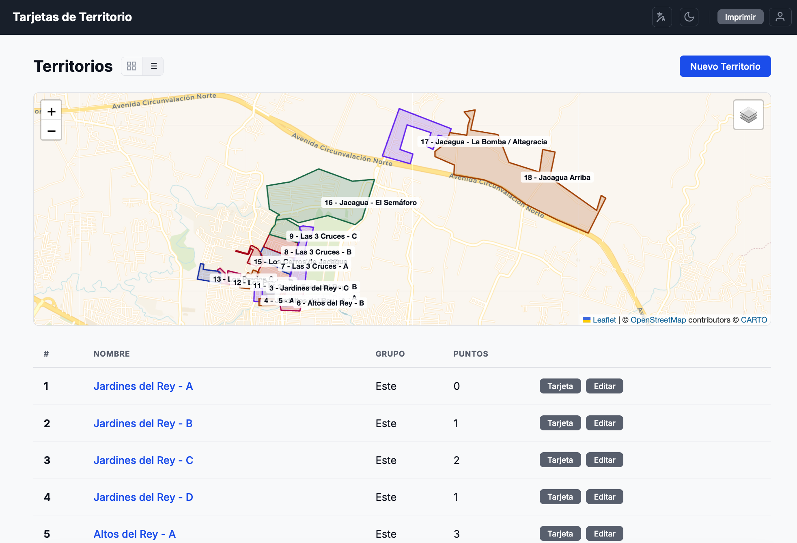

[English](README.en.md)

# Tarjetas de Territorio — Gestor para Congregaciones

Una aplicación web para gestionar, asignar e imprimir tarjetas de territorio de congregaciones. Funciona en dos modos: **sin conexión** (datos en localStorage) o **en línea** (Firebase, datos compartidos en tiempo real).

## Video Tutorial

Mira el tutorial completo donde se explica cada función paso a paso:

- [Ver en YouTube](https://youtu.be/vCRbdb3Vsfw)
- [Ver en Delonix Videos](https://videos.delonix.io/recordings/wrgPabe7elLTCmFBIQbW)

## Documentación Completa

La [Guía de Usuario](docs/guia-de-usuario.html) incluye instrucciones detalladas con capturas de pantalla para todas las funciones de la aplicación: crear territorios, asignar, imprimir tarjetas, gestionar roles y más.

## Funcionalidades

- **Gestión de territorios** — Crea, edita y elimina territorios con polígonos sobre un mapa interactivo (Leaflet)
- **Puntos de referencia** — Marcadores de colores en el mapa para ubicar lugares clave
- **Manzanas** — Etiquetas numeradas para bloques de calles dentro del territorio
- **Asignaciones** — Asigna territorios a publicadores con historial completo de trabajo
- **Tarjetas imprimibles** — Vista de tarjeta con mapa, polígono, referencias y QR opcional
- **Descarga PNG** — Descarga tarjetas como imágenes de alta resolución (2x)
- **Imprimir todo** — Renderiza todas las tarjetas para impresión masiva
- **Compartir** — Links públicos para compartir territorios sin necesidad de cuenta
- **Roles y permisos** — Tres niveles: Administrador, Conductor, Publicador
- **Importar KML/KMZ** — Importa polígonos desde Google Earth
- **Bilingue** — Interfaz en español e inglés
- **Tema claro/oscuro** — Con persistencia en localStorage

## Inicio Rápido

### Modo Offline (sin servidor)

1. Clona o descarga este repositorio
2. Ejecuta `npm install && npm run build` (o usa el deploy en GitHub Pages)
3. Abre la app y selecciona **"Usar sin conexión"**
4. Crea tu primer territorio

### Modo Online (Firebase)

1. Abre la app y haz clic en **"Crear cuenta"**
2. Inicia sesión con tu cuenta de Google
3. Registra el nombre de tu congregación
4. Invita miembros desde el panel de administración

## Guardar tus Datos

- **Guardar JSON** — Descarga todos los territorios, puntos e historial como archivo JSON
- **Cargar JSON** — Restaura datos desde un archivo guardado
- **Importar KML** — Importa polígonos de Google Earth

## Stack Tecnológico

- Vanilla JavaScript con Vite (bundler)
- Leaflet.js + Leaflet.draw (mapas y polígonos)
- Firebase Auth + Firestore (modo online)
- html-to-image (exportación PNG)
- qrcode (generación de códigos QR)
- JSZip (extracción de KMZ)
