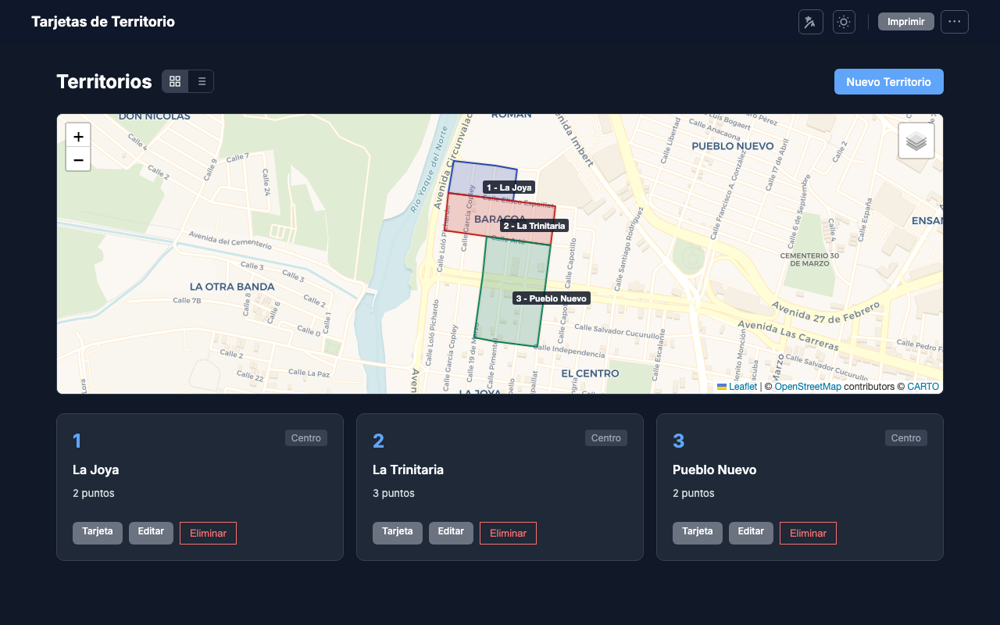
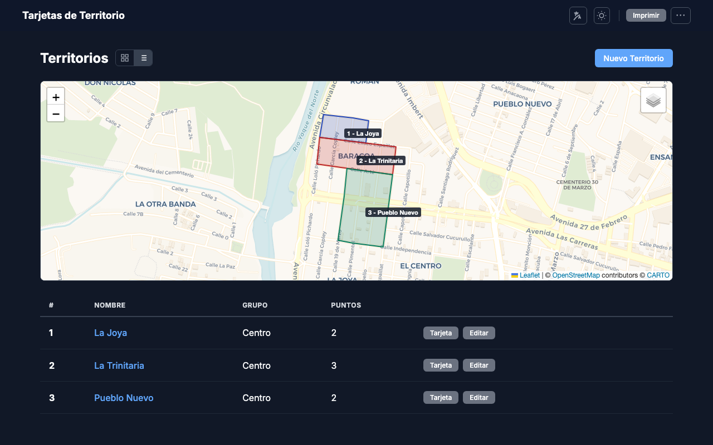
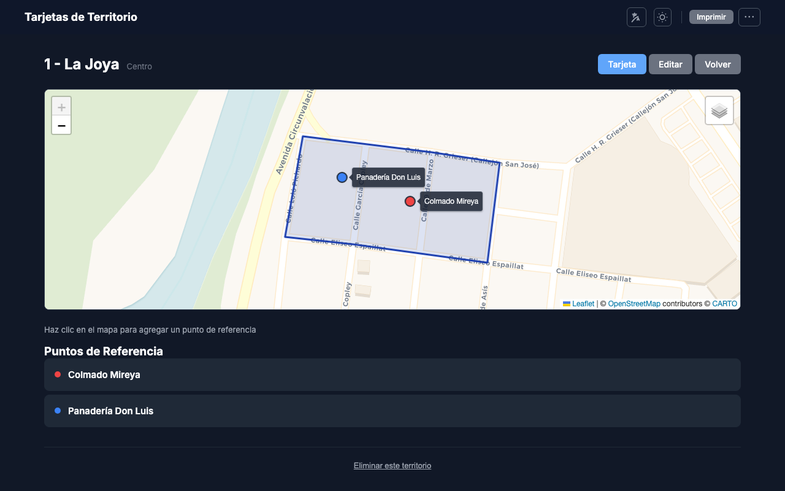
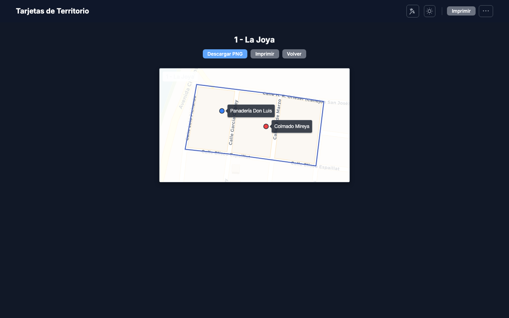
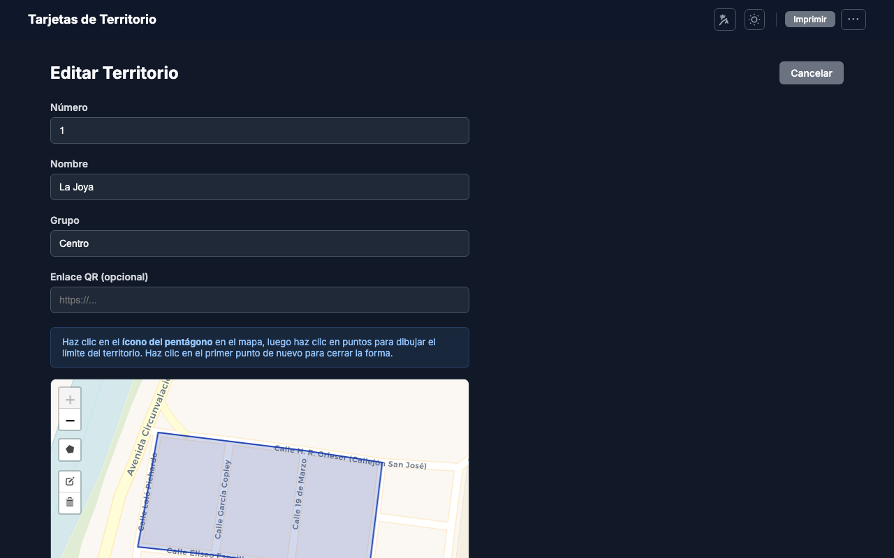
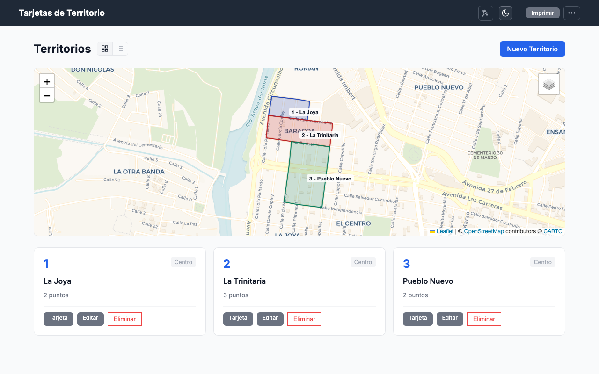

🌐 *[English](README.en.md)*

# Tarjetas de Territorio — Gestor para Congregaciones

Una aplicación web ligera, sin instalación, para gestionar tarjetas de territorio de congregaciones. Sin servidor, sin base de datos — solo abre `index.html` en tu navegador.

## Funcionalidades

- **Gestión de territorios** — Crea, edita y elimina territorios con polígonos dibujados sobre un mapa interactivo (Leaflet).
- **Puntos de referencia** — Haz clic en el mapa para agregar marcadores de colores a cada territorio.
- **Tarjetas de territorio** — Vista de tarjeta imprimible con mapa estático, máscara de polígono, etiquetas de puntos y código QR opcional.
- **Descarga PNG** — Descarga cualquier tarjeta como imagen PNG en alta resolución (2x).
- **Imprimir todo** — Renderiza todas las tarjetas para impresión masiva.
- **Importar KML/KMZ** — Importa polígonos de territorios desde archivos de Google Earth.
- **Modo oscuro/claro** — Alternador de tema con persistencia en localStorage.
- **Bilingüe** — Interfaz en español e inglés.
- **Vista de tarjetas/tabla** — Alterna entre vista de cuadrícula y lista de tabla para los territorios.

## Cómo Usar

1. Descarga o clona este repositorio
2. Abre `index.html` en tu navegador
3. ¡Listo!

Sin servidor, sin Node.js, sin paso de compilación. Funciona offline y desde `file://`.

## Vistas

### Detalle del territorio
Muestra el mapa con el polígono y los puntos de referencia. Haz clic en el mapa para agregar nuevos puntos.

### Tarjeta imprimible
Tarjeta lista para imprimir o descargar como PNG.

### Formulario de edición
Edita el nombre, número, grupo y dibuja el polígono del territorio.

### Modo claro
La aplicación soporta modo oscuro y claro.

## Guardar tus Datos

- Haz clic en **Guardar JSON** para descargar tus territorios como archivo
- Haz clic en **Cargar JSON** para restaurar desde un archivo guardado
- **Consejo:** Guarda tu archivo JSON en Google Drive o Dropbox para respaldo automático

## Importar desde Google Earth

1. Exporta tus territorios como KML o KMZ desde Google Earth
2. Haz clic en **Importar KML** y selecciona el archivo
3. Los territorios se agregarán automáticamente

## Stack Tecnológico

- HTML, CSS y JavaScript puro (sin frameworks)
- Leaflet.js + Leaflet.draw (mapas y dibujo de polígonos)
- html2canvas (exportación PNG)
- qrcodejs (generación de códigos QR)
- JSZip (extracción de KMZ)
- localStorage para persistencia de datos
