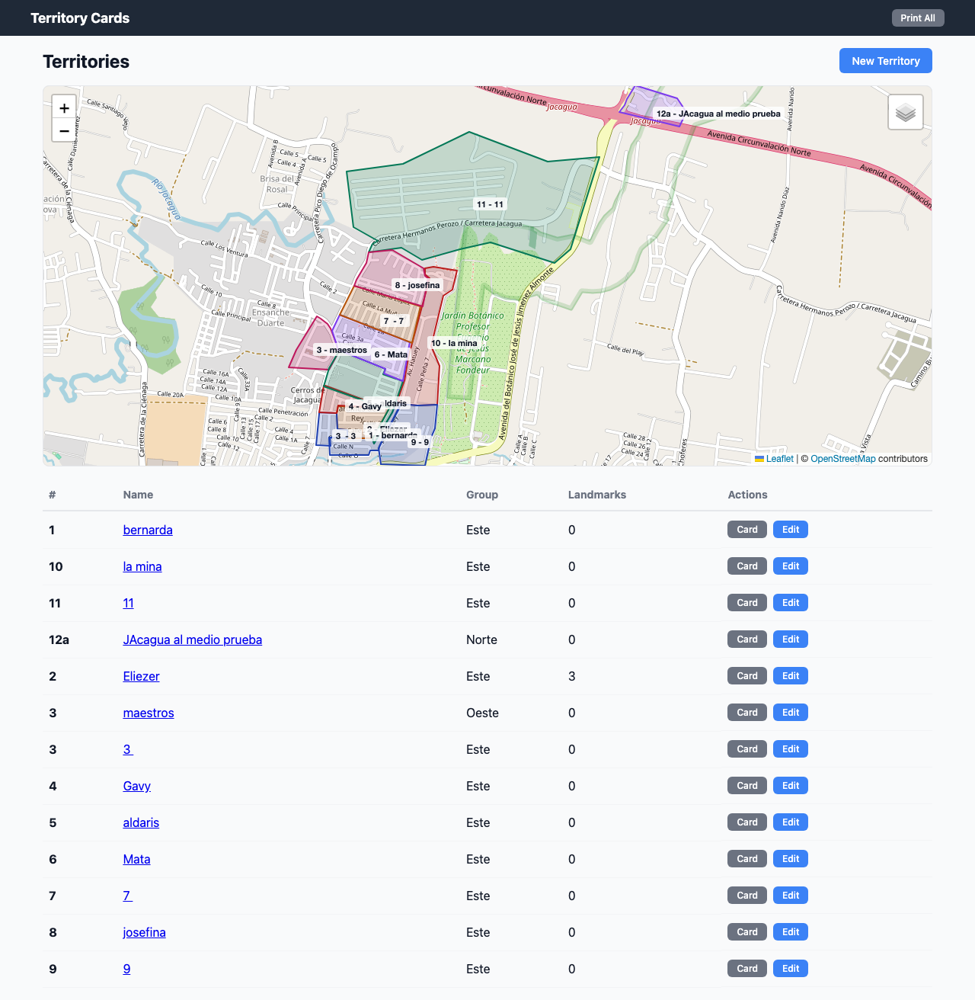
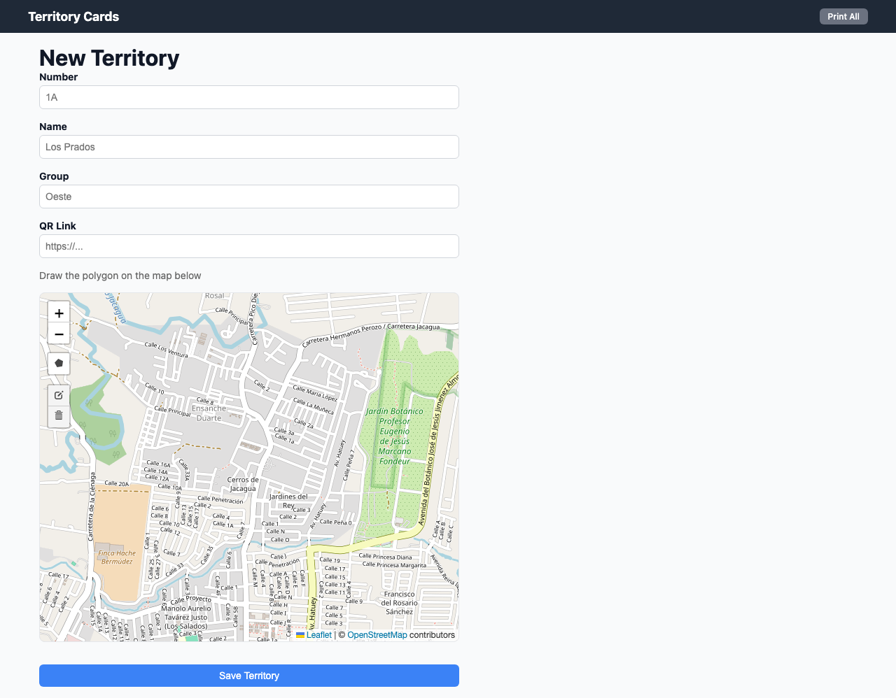
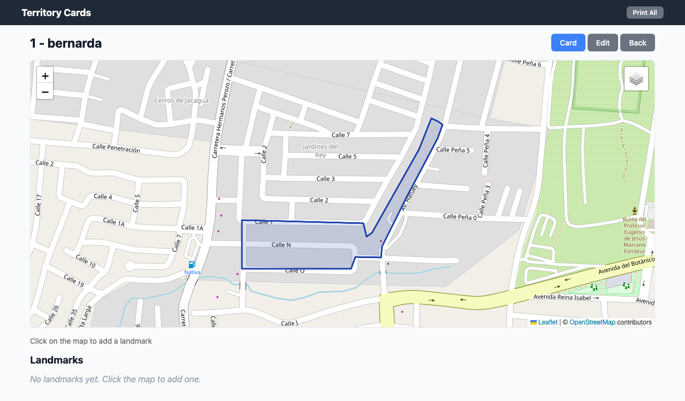
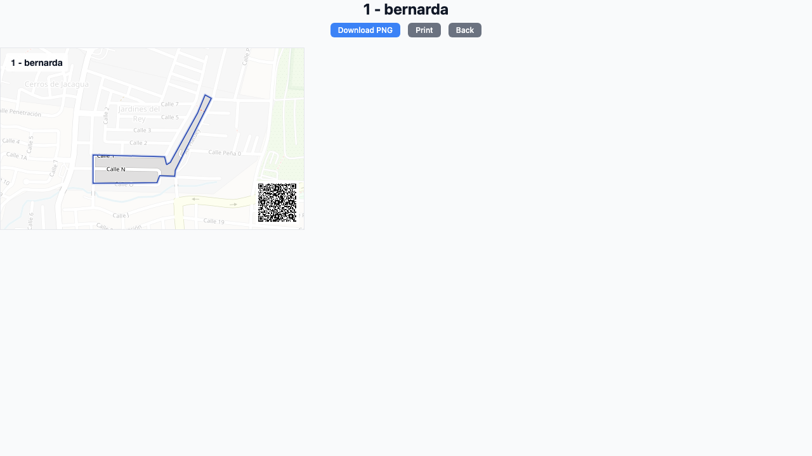
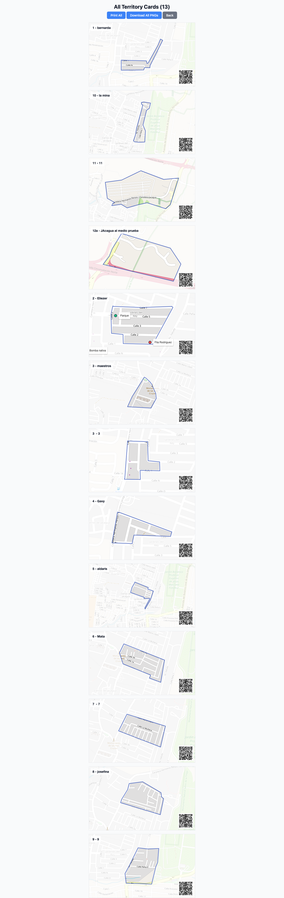

# Congregation Territory Card Manager

An application for managing congregation territory cards. Territories are defined by drawing polygons on an interactive map and each one can be viewed as a printable card with a map and optional QR code.

## Screenshots

### Main page — Territory list with map



Shows all territories in a table and on an interactive map with colored polygons. From here you can create, edit, or view the card for each territory.

### Create new territory



Form to create a new territory. Draw the polygon directly on the map using the drawing tools.

### View territory with landmarks



Individual territory view with its polygon on the map. You can click on the map to add colored landmarks (points of reference).

### Printable card



Card ready to print or download as a PNG image. Includes the territory map, name, number, and QR code.

### Print all cards



View with all cards for bulk printing.

---

## Prerequisites

Before installing the application you need the following installed on your computer:

### 1. Ruby (version 3.1 or higher)

Ruby is the programming language used by the application.

- **Mac:** It comes preinstalled but it may be an old version. We recommend installing with [rbenv](https://github.com/rbenv/rbenv#installation):
  ```bash
  brew install rbenv ruby-build
  rbenv install 3.1.3
  rbenv global 3.1.3
  ```
- **Windows:** Use [RubyInstaller](https://rubyinstaller.org/) — download the installer and follow the steps.
- **Linux (Ubuntu/Debian):**
  ```bash
  sudo apt update
  sudo apt install rbenv ruby-build
  rbenv install 3.1.3
  rbenv global 3.1.3
  ```

To verify Ruby is installed, open a terminal and type:
```bash
ruby --version
```
It should show something like `ruby 3.1.3`.

### 2. Rails 7

Rails is the web framework used by the application. Once Ruby is installed, install Rails:

```bash
gem install rails -v '~> 7.0'
```

Official installation guide: [https://guides.rubyonrails.org/getting_started.html](https://guides.rubyonrails.org/getting_started.html)

### 3. PostgreSQL

PostgreSQL is the database used by the application.

- **Mac:**
  ```bash
  brew install postgresql@14
  brew services start postgresql@14
  ```
  Or download [Postgres.app](https://postgresapp.com/) which is easier — just drag it to Applications and open it.

- **Windows:** Download the installer from [postgresql.org/download](https://www.postgresql.org/download/windows/) and follow the wizard. Remember the password you set.

- **Linux (Ubuntu/Debian):**
  ```bash
  sudo apt install postgresql postgresql-contrib libpq-dev
  sudo systemctl start postgresql
  ```

### 4. Git

Git is used to download the application code.

- **Mac:** It comes preinstalled. If not, install with `brew install git`.
- **Windows:** Download from [git-scm.com](https://git-scm.com/download/win).
- **Linux:** `sudo apt install git`

### 5. Homebrew (Mac only)

If you're on Mac and don't have Homebrew, install it first:

```bash
/bin/bash -c "$(curl -fsSL https://raw.githubusercontent.com/Homebrew/install/HEAD/install.sh)"
```

---

## Step-by-step installation

### Step 1: Download the code

Open a terminal and run:

```bash
git clone https://github.com/YOUR-USERNAME/congregation-territory-card-manager.git
cd congregation-territory-card-manager
```

> Replace `YOUR-USERNAME` with the GitHub username where the repository is hosted.

### Step 2: Install Ruby dependencies

Inside the project folder, run:

```bash
bundle install
```

If you see an error about `pg`, make sure PostgreSQL is installed and running.

### Step 3: Create the database

```bash
bin/rails db:create
bin/rails db:migrate
```

This creates the necessary tables (territories and landmarks) in PostgreSQL.

### Step 4: Start the server

```bash
bin/rails server
```

### Step 5: Open in the browser

Open your browser and go to:

```
http://localhost:3000
```

You can now start creating territories.

---

## How to use the application

### Create a territory

1. On the main page, click **"New Territory"**
2. Fill in the fields:
   - **Number:** Territory number (e.g., "1", "2", "3")
   - **Name:** Territory name (e.g., "Downtown", "North")
   - **Group:** Group name (optional)
   - **QR Link:** URL for the QR code (optional — if left empty, a Google Maps link is generated automatically)
3. Draw the territory polygon on the map:
   - Click the polygon icon on the map toolbar
   - Click on the map for each point of the polygon
   - Click the first point to close the polygon
4. Click **"Create Territory"**

### Add landmarks (points of reference)

1. Go to a territory page (click its name in the list)
2. Click anywhere on the map
3. Type the name of the landmark (e.g., "Pharmacy", "School")
4. The point is added automatically with a different color

### View and print cards

1. In the territory list, click **"Card"** next to the territory you want
2. To download as an image: click **"Download PNG"**
3. To print: click **"Print"**
4. To print all cards at once: click **"Print All Cards"** on the main page

### Import territories from Google Earth (KML)

If you have territories drawn in Google Earth, you can import them:

1. In Google Earth, export your territories as a `.kml` or `.kmz` file
2. Copy the file to the project folder
3. Run in the terminal:
   ```bash
   bin/rails territories:import_kml[path/to/file.kml]
   ```

---

## Troubleshooting

### "Could not find gem 'pg'" or error installing pg

PostgreSQL is not installed or cannot be found. Install PostgreSQL following the steps in the prerequisites section.

### "FATAL: role 'your_user' does not exist"

You need to create a user in PostgreSQL:
```bash
sudo -u postgres createuser --superuser $(whoami)
```

### The map doesn't load or appears gray

Check that you have an internet connection. Map tiles are loaded from OpenStreetMap and require internet access.

### "Address already in use" when starting the server

Another process is using port 3000. You can use a different port:
```bash
bin/rails server -p 3001
```
Then open `http://localhost:3001` in your browser.

---

## Technical reference

### Tech stack

| Component | Technology |
|-----------|-----------|
| Backend | Ruby on Rails 7 |
| Database | PostgreSQL |
| Frontend | Hotwire (Turbo + Stimulus) |
| Maps | Leaflet.js + Leaflet.draw |
| PNG export | html2canvas |
| QR code | qrcodejs |
| JavaScript | Importmap (no Node.js required) |

### Main routes

| Route | Description |
|-------|-------------|
| `GET /` | Main page with territory list and map |
| `GET /territories/new` | Create new territory |
| `GET /territories/:id` | View territory with landmarks |
| `GET /territories/:id/card` | Printable territory card |
| `GET /print` | All cards for bulk printing |
