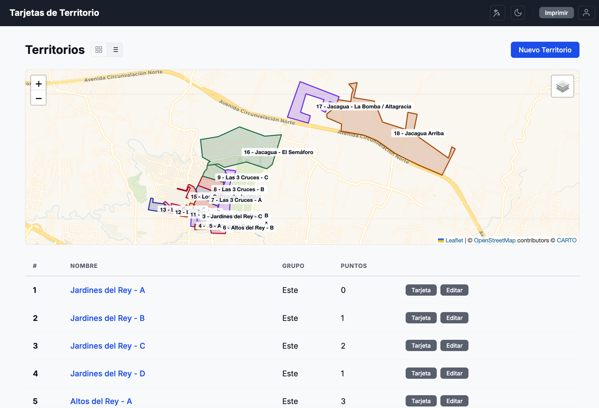

[English](README.en.md)

# Tarjetas de Territorio — Gestor para Congregaciones

Una aplicación web gratuita y de código abierto para gestionar, asignar e imprimir tarjetas de territorio para congregaciones. Funciona en dos modos: **sin conexión** (datos en tu navegador) o **en línea** (Firebase, datos compartidos en tiempo real).

**[Usar la aplicación ahora](https://elvisozoria.github.io/Congregation-territory-card-manager/)** — no requiere instalación, funciona directo desde el navegador.



## Video Tutorial

Mira el tutorial completo donde se explica cada función paso a paso. Está grabado antes del rediseño de septiembre de 2026, así que la pantalla se ve distinta, pero los conceptos siguen valiendo; la [Guía de Usuario](https://elvisozoria.github.io/Congregation-territory-card-manager/docs/guia-de-usuario.html) sí está al día:

- [Ver en YouTube](https://youtu.be/vCRbdb3Vsfw)
- [Ver en Delonix Videos](https://videos.delonix.io/recordings/wrgPabe7elLTCmFBIQbW)

## Documentación Completa

La [Guía de Usuario](https://elvisozoria.github.io/Congregation-territory-card-manager/docs/guia-de-usuario.html) incluye instrucciones detalladas con capturas de pantalla para todas las funciones: crear territorios, asignar, imprimir tarjetas, gestionar roles y más.

## Funcionalidades

**El trabajo del encargado**

- **Qué toca ahora** — Al abrir, lo que necesita atención: asignaciones que llevan mucho tiempo fuera, territorios nunca trabajados y los más olvidados
- **Asignaciones** — Asigna a cualquier persona, tenga cuenta o no, desde la lista o desde la ficha, con historial completo
- **Registro S-13** — El formulario oficial, con filtro por año de servicio y vista imprimible
- **Casas aproximadas** — Un estimado por territorio para repartir la carga parejo, con ordenación por ese número

**Territorios**

- **Gestión de territorios** — Crea, edita y elimina territorios con polígonos sobre un mapa interactivo (Leaflet)
- **Etiquetas** — Varias por territorio para filtrar y agrupar: zona, hora del día, modo de recorrido, tipo
- **Límite de la congregación** — Sube el KML de la sucursal y se dibuja sobre los mapas como guía al trazar
- **Puntos de referencia** — Marcadores de colores en el mapa para ubicar lugares clave
- **Manzanas** — Etiquetas numeradas para bloques de calles dentro del territorio

**Tarjetas**

- **Tarjetas imprimibles** — Mapa, polígono, referencias, y de forma opcional el código QR y el número de casas
- **Imprimir por sector** — Ordenadas por número, y con un filtro puesto sólo las de ese grupo
- **Descarga PNG** — Descarga tarjetas como imágenes de alta resolución (2x)
- **Compartir** — Links públicos para compartir territorios sin necesidad de cuenta

**Cuenta y congregación**

- **Roles y permisos** — Tres niveles: Administrador, Conductor, Publicador
- **Varias congregaciones** — Lleva más de una con la misma cuenta y cambia entre ellas sin cerrar sesión
- **Importar KML/KMZ** — Importa polígonos desde Google Earth, con sus descripciones como notas
- **Bilingue** — Interfaz en español e inglés
- **Tema claro/oscuro** — Con persistencia en localStorage

## Cómo Usar

### Opción 1: Usar en línea (recomendado)

Abre **[elvisozoria.github.io/Congregation-territory-card-manager](https://elvisozoria.github.io/Congregation-territory-card-manager/)** y listo. Puedes elegir modo offline (datos en tu navegador) o crear una cuenta con Google para sincronizar datos con tu congregación.

### Opción 2: Descargar y usar en tu computadora

1. Descarga o clona este repositorio
2. Ejecuta `npm install && npm run build`
3. Abre `dist/index.html` en tu navegador

Puedes modificar el código como quieras y adaptarlo a las necesidades de tu congregación.

## Guardar tus Datos

- **Guardar JSON** — Descarga todos los territorios, puntos e historial como archivo JSON
- **Cargar JSON** — Restaura datos desde un archivo guardado
- **Importar KML** — Importa polígonos de Google Earth

## Registro de cambios

Lo que ha ido cambiando está en el [CHANGELOG](CHANGELOG.md).

## Mapas

Los mapas base vienen de [CARTO](https://carto.com/basemaps/), que desde agosto de 2026 pide una llave gratuita. Si despliegas tu propia copia, pide la tuya en [carto.com/basemaps/apikey](https://carto.com/basemaps/apikey/) y ponla en la variable `VITE_CARTO_KEY` al compilar:

```
VITE_CARTO_KEY=tu-llave npm run build
```

Sin llave la aplicación funciona igual: usa los mapas de Esri, que no piden registro. Sólo cambia el estilo del mapa.

## Stack Tecnológico

- Vanilla JavaScript con Vite (bundler)
- Leaflet.js + Leaflet.draw (mapas y polígonos)
- Firebase Auth + Firestore (modo online)
- html-to-image (exportación PNG)
- qrcode (generación de códigos QR)
- JSZip (extracción de KMZ)

## Contribuir

Este es un proyecto de código abierto y todas las contribuciones son bienvenidas. Si tienes ideas para nuevas funcionalidades, encuentras un error, o quieres mejorar el código:

- Abre un [issue](https://github.com/Elvisozoria/Congregation-territory-card-manager/issues) para reportar errores o solicitar funcionalidades
- Envía un pull request con tus cambios
- Haz un fork y adáptalo a las necesidades de tu congregación

## Licencia

MIT
